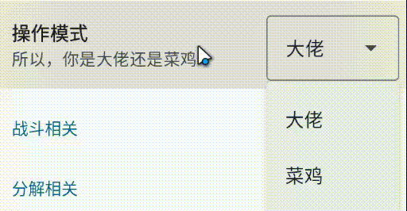

# Material Preference


This library implements Material 3 Preference theme by extending AndroidX preference theme.

## Download

```groovy
dependencies {
    implementation "dev.rikka.rikkax.material:material-preference:<version>"
}
```

## Usage

Add to your theme:

```
<!-- Extend this style if you have other custom preferences -->
<item name="preferenceTheme">@style/PreferenceThemeOverlay.Rikka.Material3</item>
```

Apply this style after `super.onCreate` in your settings Activity:

```java
context.getTheme().applyStyle(rikka.material.preference.R.style.ThemeOverlay_Rikka_Material3_Preference, true);
```

## Changelog

### 2025/04/04 (update to future versions)

- Add `rikka.material.preference.MaterialComboBoxPreference`

 

### 2.0.0

- (Breaking change) Use [Material 3 style](https://m3.material.io/components/switch/guidelines) rather than system settings style
- Add `rikka.material.preference.MaterialSwitchPreference` which uses `MaterialSwitch` from Material Components 1.7.0

Note, current version of Material Components (1.7.0-alpha02) requires the user to add `<item name="materialSwitchStyle">@style/Widget.Material3.CompoundButton.MaterialSwitch</item>` to the theme. If you are using `dev.rikka.rikkax.material:material` v2.5.0+, this has been already done.

### 1.0.0

- Port Preference style from Android 12 system settings
